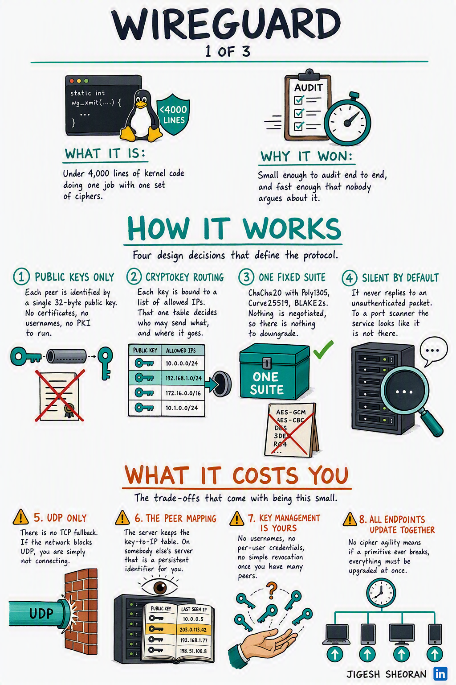
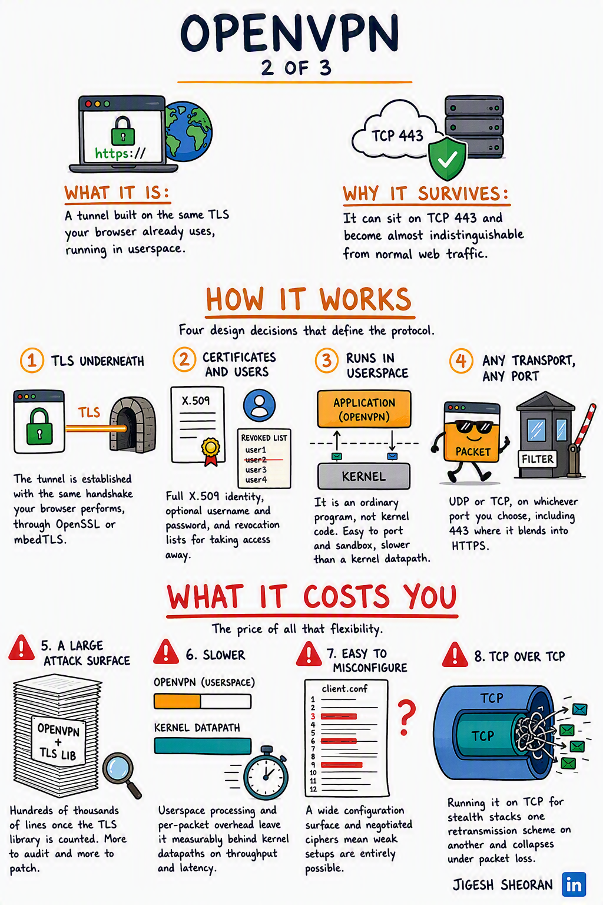
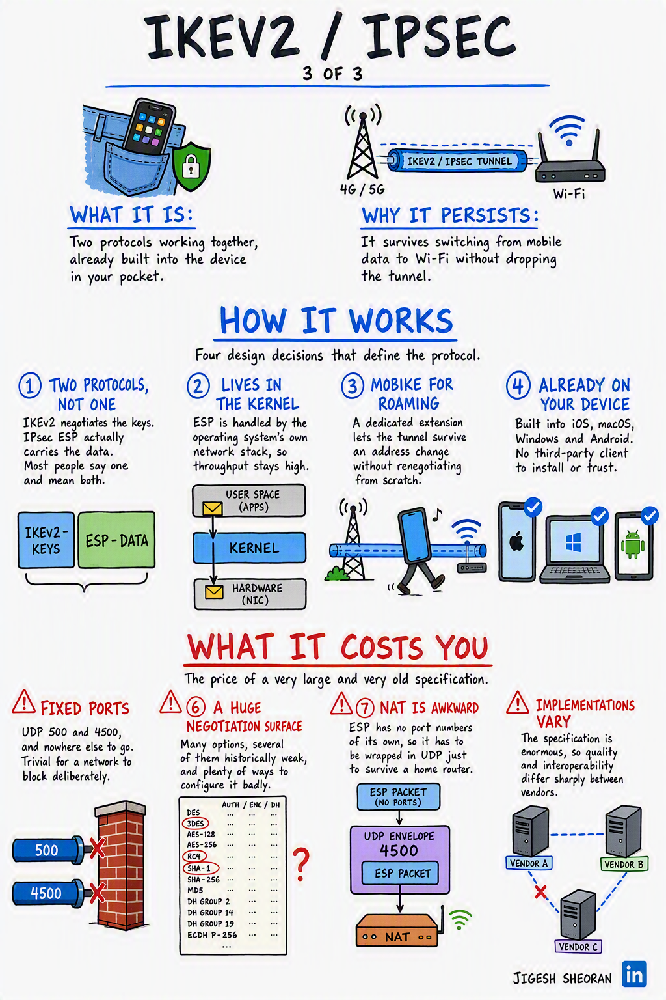

# Handwritten Infographic — a Claude Skill

Turn any technical topic into a hand-drawn, notebook-style explainer that shows
**both how the thing works and what it costs you.**

No API key. No image API billing. Works with whatever image model you already
use — Designer, ChatGPT, Gemini, Midjourney, Firefly.

<p align="center">
  
  
  
</p>

## Why this exists

Most explainer infographics only sell the thing. Four boxes, four upsides, an
arrow, done. They are pleasant and they teach nobody anything, because the part
an engineer actually needs — *what does this cost me?* — is missing.

This skill enforces a two-half layout:

- **`HOW IT WORKS`** — cards 1 to 4, the design decisions
- **`WHAT IT COSTS YOU`** — cards 5 to 8, the trade-offs you inherit

Numbered continuously, 1 through 8, so the reader gets the price in the same
glance as the pitch. The skill will not build a panel that is four upsides and
four more upsides.

## What you get

Give Claude a topic. You get back three files:

```
How X Works/
├── spec.json       the content, linted against the layout's budgets
├── prompt.txt      paste this into any image model
└── checklist.md    proofread the result against this
```

### The proofread step is the point

Image models are bad at text in specific, repeatable ways, and this layout
provokes the worst of them. Here is a real defect in a published panel — the
costs row, where cards 5 and 8 lost their numbers entirely because the warning
triangle occupied the slot the numeral wanted:

<p align="center">
  
</p>

The generated `checklist.md` lists every card, every number, and every
technical term worth spell-checking (`ChaCha20`, `Curve25519`, `X.509`,
`mbedTLS`), so you catch that before it ships instead of after someone
comments about it.

## Install

### Claude (web, desktop, mobile)

1. Download the latest `handwritten-infographic.zip` from
   [Releases](../../releases).
2. Settings → Capabilities → Skills → **Upload skill**.

### Claude Code

```bash
git clone https://github.com/sheoraninfosec/handwritten-infographic-skill.git
mkdir -p ~/.claude/skills
cp -r handwritten-infographic-skill/skills/handwritten-infographic ~/.claude/skills/
```

Then just ask:

> Make a handwritten infographic about how TLS session resumption works.

## How it works

1. **Claude researches the topic** and writes a content spec — two intro
   blurbs, four design decisions, four costs, and a scene description for every
   sketch.
2. **`build_prompt.py` lints it.** Word budgets, heading lengths, continuous
   1–8 numbering, banned marketing words, vague sketch descriptions, red
   accents colliding with the warning colour. It refuses to build on errors, so
   a broken spec never reaches the image model.
3. **It emits the prompt and the checklist.**
4. **You generate the image** in your tool of choice at 1024 × 1536.
5. **Claude proofreads the result** against the checklist and offers a targeted
   re-roll for anything that came out wrong.

The linter is pure Python standard library. No dependencies, no network calls,
no keys.

```
$ python3 scripts/build_prompt.py spec.json --lint-only
  warn   costs.cards[1] (#6).body: 28 words, budget is 12-26
  ERROR  accent: #D32F2F is red — red is reserved for the costs half, pick a neighbouring hue or the ink navy
  ERROR  how.cards[0] (#1).heading: must be ALL CAPS
  ERROR  costs.cards[2] (#7).body: banned marketing word 'powerful'
  ERROR  costs.cards[3] (#8).draw: 'an icon' is an icon name, not a scene — say what objects appear and where

4 error(s). Fix the spec and run again — a broken spec produces a broken image.
```

## The layout

Reverse-engineered from published panels and documented zone by zone in
[`reference/layout-explainer.md`](skills/handwritten-infographic/reference/layout-explainer.md):
1024 × 1536, off-white `#F7F8F8` with no paper texture, ink `#192635`, one
topic-brand accent, warning `#C62828` reserved for the costs half.

Writing rules, word budgets and the method for finding four real trade-offs are
in [`reference/writing-rules.md`](skills/handwritten-infographic/reference/writing-rules.md).

## Making a series

Set `series` in the spec to `1 OF 3`, `2 OF 3`, `3 OF 3`. Series panels share
the `HOW IT WORKS` subtitle and differ in the `WHAT IT COSTS YOU` subtitle,
which names the specific price that specific design pays. The three examples
are one such series.

## Repository layout

```
skills/handwritten-infographic/
├── SKILL.md                      the workflow Claude follows
├── reference/
│   ├── layout-explainer.md       geometry, palette, typography
│   ├── writing-rules.md          voice, budgets, finding the costs
│   └── worked-examples.md        how the three examples were built
├── scripts/build_prompt.py       linter and prompt builder
└── templates/spec.template.json  the skeleton to copy

examples/{wireguard,openvpn,ikev2}/   complete specs, prompts and outputs
```

## Contributing

The skill ships one layout. Three more are documented in the published set and
are not built yet — a **Versus** comparison, a **Trust check** (risks, then
what you can verify), and an **Annotated hardware** diagram with callouts and a
legend. A new layout needs a reference doc, a template and a `build_prompt.py`
branch. Issues and pull requests welcome.

## License

MIT. See [LICENSE](LICENSE).

---

Built by [Jigesh Sheoran](https://www.linkedin.com/in/jigeshsheoran/). If the
skill saved you an afternoon, a star helps other people find it.
